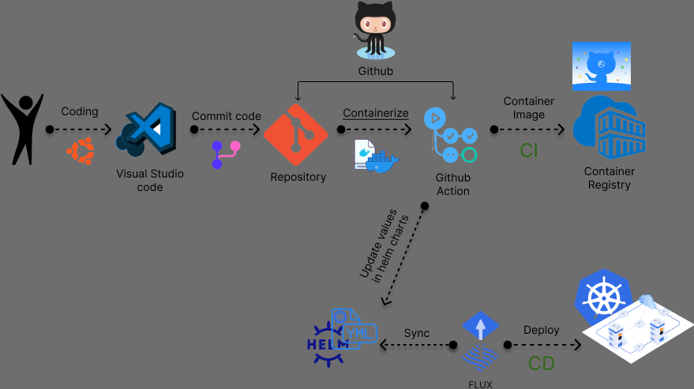

# Terraform GKE and Flux bootstrap configuration

This Terraform configuration creates a Google Kubernetes Engine (GKE) cluster, initializes a Github repository, and sets up Flux for GitOps on the cluster.

Here is a brief explanation of each module:

1. **gke_cluster**: This module creates a GKE cluster in the specified Google Cloud region and project. It configures the cluster with the provided number of nodes.

2. **github_repository**: This module creates a Github repository with the specified owner, repository name, and Github token. It also sets up an SSH key for the repository with the public key provided.

3. **flux_bootstrap**: This module bootstraps Flux on the GKE cluster created earlier. It uses the Github repository and token provided, and it authenticates to the Github repository using the provided private key. The module uses the kubeconfig file generated by the gke_cluster module to authenticate to the GKE cluster.

4. **tls_private_key**: This module creates a private and public key pair that are used by the github_repository and flux_bootstrap modules for authentication.

5. **backend**: This configuration stores the Terraform state in a Google Cloud Storage (GCS) bucket. This allows the state to be shared between multiple people or CI/CD systems and provides a backup of the state.

Before running this configuration, make sure you have set the required variables for each module, such as the Google Cloud region and project, Github owner and token, and the name of the Github repository to use for Flux.

To run this configuration, initialize Terraform with `terraform init`, plan the changes with `terraform plan`, and apply them with `terraform apply`.

Remember to protect sensitive information, such as tokens and private keys. Do not expose these in your scripts or console logs. 

If you wish to see the content of the kubeconfig file or its path, you can check the respective outputs with `terraform output kubeconfig_content` or `terraform output kubeconfig_path`. Be aware that the actual content of the kubeconfig file is sensitive and it's advisable not to print it in an unsecured environment.

Finally, to destroy the resources created by this configuration, you can use `terraform destroy`.

